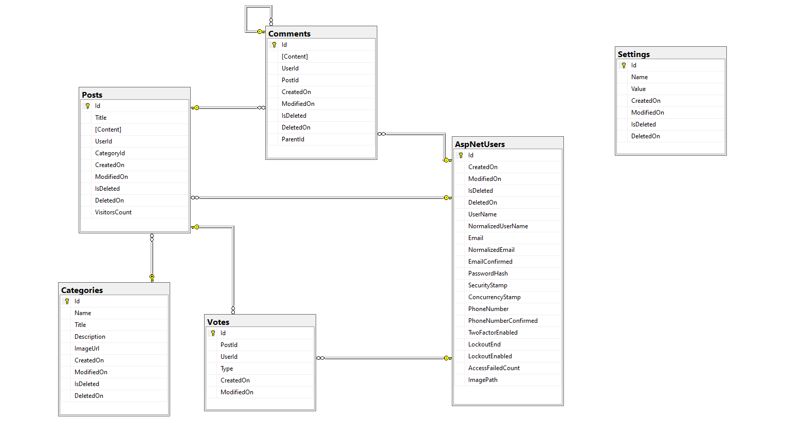

# Forum System
Система за създадване, четене, управление на постове със свободен достъп.

## Функционалност
* Регистрация на потребители
* Възможност за разглеждане, създадване, четене на постове
* Възможност за коментиране, харесване и запазване на постове
* Възможност за филтриране по категория на постовете и търсене по заглавие
* Чат стая позволяваща на потребителите да обменят съобщения
* Кеширане на данните 'Memory Cache'(see below) в 'Home' страницата, с цел намаляне на заявките към базата данни
* Интерактивен, гъвкав UX

## Технологии
* C#, ASP.NET Core MVC
* MS SQL, Entity Framework Core
* HTML, CSS, JavaScript
* Auto-Mapper, jQuery
* TinyMCE, Moment.js
* Bootstrap
* Font Awesome Icons

## This is the current state of database diagrams relations in my app.



* Memory Cache - Implementation
```javascript
if (!this.cache.TryGetValue<IEnumerable<HomePostViewModel>>("Posts",
out var posts))
{
    posts = this.postsService.GetAllPosts<HomePostViewModel>();

    var cacheEntryOptions = new MemoryCacheEntryOptions()
        .SetAbsoluteExpiration(TimeSpan.FromSeconds(100));

    this.cache.Set("Posts", posts, cacheEntryOptions);
}
```

### Контрол на достъпа
* Гостите могат да се регистрират, да преглеждат каталога, детайлите на тестовете и профилните страници на потребителите
* Регистрираните потребители могат да решават тестове, да преглеждат резултатите си и да създават и редактират тестове
* Само създателя на един тест може да го редактира и изтрива
* Всеки регистриран потребител може да решава чужд тест