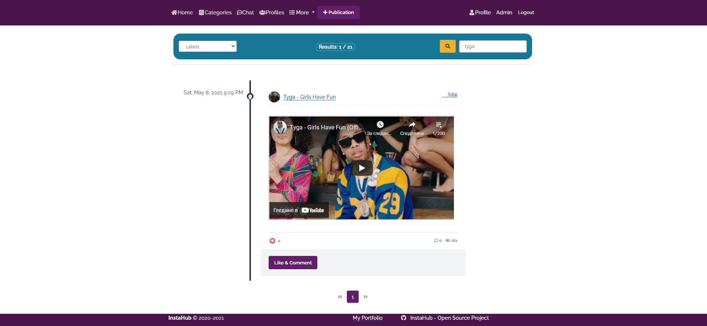
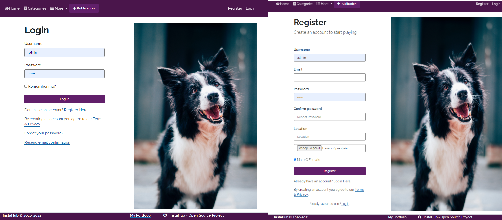
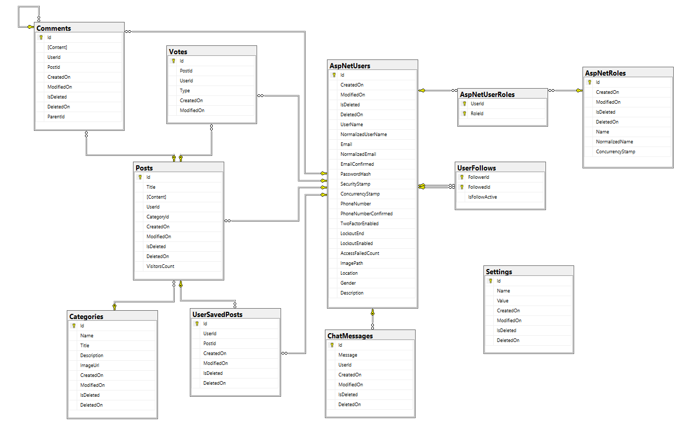
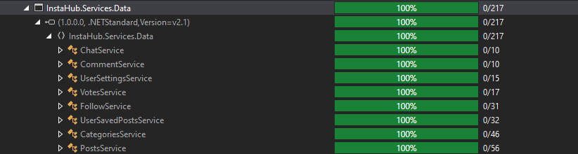

# Project Introduction
InstaHub is my defense project for ASP.NET Core MVC course at SoftUni (April-June 2021). The website is..

# Overview
ASP.NET Core Template Author - 
<a href="https://github.com/NikolayIT" target="_blank">NikolayIT</a>
* Template for ASP.NET Core with repositories, services, models mapping, DI and StyleCop warnings fixed.

# Functionality
* Users Registration.
* Ability to View, Create, Read Publications.
* Ability to Comment, like, save and print publications.
* Ability to Edit and Delete publications (Only for the creator).
* Ability to Follow users, as well as be followed by other users.
* Ability to Filter publications by category and search by Title.
* Chat room allowing users to exchange messages.
* Cache Data 'Memory Cache' (see below in HomePage) to reduce database queries.
* Interactive, flexible UX (User Experience)

# Built With
* ASP.NET Core 5 MVC
* ASP.NET CORE view components
* ASP.NET Core areas
* MSSQL Server
* Entity Framework Core
* Auto-Mapper
* SignalR
* SendGrid
* AJAX
* jQuery
* Moq
* XUnit
* <a href="https://www.nuget.org/packages/X.PagedList.Mvc/">X.PagedList.Mvc</a>
* Bootstrap
* Font Awesome Icons

# Client Side Libraries
* TinyMCE
* Moment.js

# Interface

Home page


Login / Register


Posts/ById/{postId}


# Database Diagram



# Testing

* 100% Tests Coverage of Services



# Implementation

* Followings / Followers (Model)
```javascript
class UserFollow
{
    public string FollowerId { get; set; }

    public string FollowedId { get; set; }

    public bool IsFollowActive { get; set; }
}
// To see the rest of the functionality go on Follow(Service/Controller)
```

* Memory Cache
```javascript
if (!this.cache.TryGetValue<IEnumerable<HomePostViewModel>>("Posts",
out var posts))
{
    posts = this.postsService.GetAllPosts<HomePostViewModel>();

    var cacheEntryOptions = new MemoryCacheEntryOptions()
        .SetAbsoluteExpiration(TimeSpan.FromSeconds(100));

    this.cache.Set("Posts", posts, cacheEntryOptions);
}
```
* Print
```javascript
<a onclick="window.print()" class="btn btn-warning">
    <i class="fas fa-print"></i>&nbsp; Print
</a>
```

# Access control
* Logged users can create, read publications.
* Logged users can view publications by category, details, user profile page, and also can search and filter publications.
* Only creator of the publication can Edit and Delete it.
* Logged users can like and comments other publications.